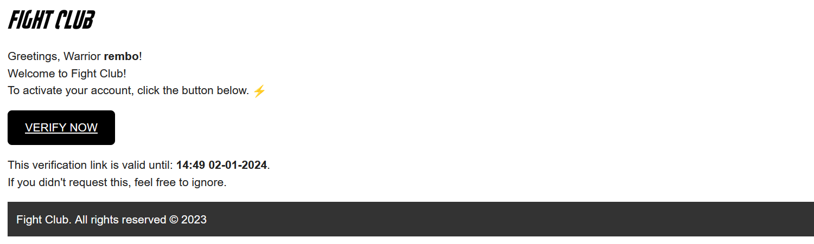
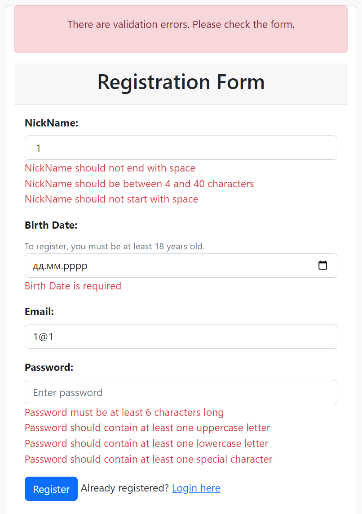
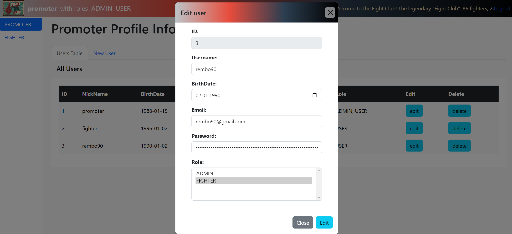

# Fight Club Project Spring Boot + JavaScript
___

## Overview

The "FightClubProject SB + JS" project is a Spring Boot web application that demonstrates controlled access to resources based on the user role, using the example of a fight club manager. In this project, users ("FIGHTERS") can identify themselves in the system, and an administrator ("PROMOTER") can manage their data. Account validation is done through email.

To test the project, start it in a local environment and open the link in your browser: http://localhost:8080.
___

___

## Project Structure

The project is organized into different packages and classes to improve code support and understanding:

#### 1. model:
- *USER and ROLE classes:* This defines the basic components of the object-oriented model. It defines the data structure and provides for their interaction.
- *ExpirationManager:* Manages the expiration time of verification codes.
- *AgeManager:* Handles operations related to the user's age.

#### 2. repository:
- *UserRepository and RoleRepository:* Classes that contain interfaces and queries for interacting with the database through JPA.

#### 3. service:
- *UserService:* Manages operations related to users, including registration, validation, and CRUD.
- *RoleService:* Manages operations related to roles.
- *EmailVerificationService:* Creates and sends emails for email verification.
___

___

#### 4. controller:
- *MainController:* Handles HTTP requests related to the main part of the project, such as registration, login, verification, and user validation.
- *registerNewUser:* Registers a new user, generates a verification code, and sends an email with a request for verification.
- *verifyUser:* Verifies a user based on the provided verification code.
- *AdminController:* Handles administrator operations and CRUD functionality.
___

___

#### 5. security:
- *SecurityConfig:* Configures security settings, including role-based access control.
- *SuccessUserHandler:* Custom authentication success handler that redirects users to the /fight-club page.

#### 6. resources/templates:
- *view-main-page.html:* The main HTML template for the user interface. Contains a navigation bar, a user table, and a modal window for adding, editing, and deleting users.
- *Navbar:* Includes navigation links and an exit option. Also implemented here is a ***"marquee"*** strip.
- *Sidebar:* Shows tabs for fighter and promoter.
- *Admin Panel:* Includes tabs for viewing all users and performing CRUD operations.
- *Modal windows:* Display user details and provide for CRUD operations.
___

___

#### 6. JavaScript-файли:
- *view.js:* Contains common JavaScript functions for the main page.
- *get.js, post.js, update.js, delete.js:* Handle AJAX requests for GET, POST, PUT, and DELETE operations.
- *Adding, updating, and deleting users:* Are performed using ***AJAX*** requests that are handled by the corresponding JavaScript files.
- If the operation is successful, the user table is updated and the form is cleared.
- In case of errors, the server returns an error response handled by the corresponding JavaScript file.
- Each ObjectError object, which represents a validation error, is added to the ***errorMessages*** list and returned as part of the ***BAD_REQUEST*** response.
- Errors are displayed to the user as ***alerts*** on the page.
___

___

## Description of used technologies

- ***Java 11:*** The main programming language for both server and client parts of the project.
- ***Maven:*** Used to manage project dependencies and ensure its efficient build.
- ***Spring:*** Used to create a web application, provide security, and interact with a database.
- ***Spring Boot:*** Simplify the development of web applications on Spring and provides ready-made components such as Spring MVC and Spring Security.
- ***Spring MVC:*** Used to create web applications with the MVC architecture.
- ***Spring Security:*** Provides web application security through authentication.
- ***MySQL:*** Used to store project data, such as user profiles in a relational database.
- ***Hibernate:*** Provides object-relational mapping, which allows easy interaction with database data.
- ***Rest API:*** Provides access to project data to the web client.
- ***Thymeleaf:*** Used to create web forms and user interfaces.
- ***Bootstrap:*** Used to style web pages.
- ***JavaScript:*** Used to create interactive web pages.
- ***AJAX:*** Used to synchronize the user profile.
- ***Fetch API:*** A built-in JavaScript API that simplifies the use of AJAX.
- ***JUnit:*** A Java unit testing framework.
- ***Mockito:*** A framework for creating mock objects during testing.

---

#### The Fight Club Project SB + JS is a showcase of Spring Boot's capabilities for building secure web applications. The project's well-organized structure and consistent code make it easy to understand and extend.
