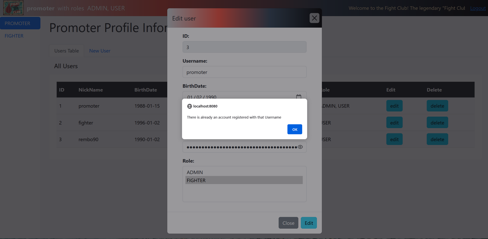

# Fight Club Project Spring Boot + JavaScript
___

## Огляд проекту

Проєкт "FightClubProjectSBJS"  - це вебдодаток на базі Spring Boot, який демонструє контрольований доступ до ресурсів в залежності від ролі користувача, на прикладі менеджера бійцівського клубу. У цьому проекті користувачі ("FIGHTERS") можуть ідентифікувати себе в системі, а адміністратор ("PROMOTER") може управляти їхніми даними. Валідація облікового запису здійснюється через електронну пошту.

Щоб протестувати проєкт, запустіть його в локальному середовищі та відкрийте посилання у браузері: http://localhost:8080.
___

___

## Структура проекту

Проєкт організований у різні пакети та класи для кращої підтримки коду та розуміння його роботи:

#### 1. model:
- *Класи USER та ROLE:* Представляють основні компоненти моделі ООП. Вони визначають структуру даних та забезпечують їх взаємодію.
- *ExpirationManager:* Управляє часом дії кодів верифікації.
- *AgeManager:* Обробляє операції, пов'язані з віком користувача.

#### 2. repository:
- *UserRepository та RoleRepository:* Класи, що містять інтерфейси та query для взаємодії з базою даних через JPA.

#### 3. service:
- *UserService:* Управляє операціями, пов'язаними з користувачем, включаючи реєстрацію, валідацію та CRUD.
- *RoleService:* Управляє операціями, пов'язаними з ролями.
- *EmailVerificationService:* Створює та надсилає листи для верифікації на електронну пошту.
___

___

#### 4. controller:
- *MainController:* Обробляє HTTP-запити, пов'язані з основною частиною проєкту, такі як реєстрація, вхід, верифікація та валідація користувача.
- *registerNewUser:* Реєструє нового користувача, генерує код верифікації та надсилає лист із запитом на верифікацію.
- *verifyUser:* Верифікує користувача на основі наданого коду верифікації.
- *AdminController:* Управляє операціями адміністратора та функціоналістю CRUD.
___

___

#### 5. security:
- *SecurityConfig:* Налаштовує параметри безпеки, включаючи контроль доступу на основі ролей.
- *SuccessUserHandler:* Власний обробник аутентифікації успішного входу, перенаправляє користувачів на сторінку /fight-club.

#### 6. resources/templates:
- *view-main-page.html:* Основний HTML-шаблон для інтерфейсу користувача. Містить навігаційну панель, таблицю користувачів та модальне вікно для додавання, редагування та видалення користувачів.
- *Navbar:* Включає навігаційні посилання та опцію виходу. Також тут реалізована *"біжуча"* стрічка ***(marquee)***.
- *Sidebar:* Показує вкладки для fighter та promoter.
- *Адміністраторська панель:* Включає вкладки для перегляду всіх користувачів, та виконання операцій CRUD.
- *Модальні вікна:* Відображають деталі користувача та забезпечують виконання операцій CRUD.
___

___

#### 6. JavaScript-файли:
- *view.js:* Містить загальні функції JavaScript для основної сторінки.
- *get.js, post.js, update.js, delete.js:* Обробляють AJAX-запити для операцій GET, POST, PUT та DELETE.
- *Додавання, оновлення та видалення користувачів* відбувається за допомогою ***AJAX-запитів***, які обробляються відповідними JavaScript-файлами.
- Якщо операція успішна, відбувається оновлення таблиці користувачів, очищення форми.
- У випадку помилок, сервер повертає відповідь зі статусом помилки, яка обробляється відповідним JavaScript-файлом. 
- Кожен об'єкт ObjectError, який представляє помилку валідації, додається до списку ***errorMessages*** та повертається як частина відповіді зі статусом ***BAD_REQUEST***.
- Помилки виводяться користувачеві у вигляді ***алертів*** на сторінці.
___

___

## Опис використаних технологій

- ***Java 11:*** Основна мова розробки для серверної та клієнтської частини проєкту.
- ***Maven:*** Використовується для управління залежностями проєкту та забезпечення його ефективної збірки.
- ***Spring:*** Використовується для створення вебдодатку, забезпечення безпеки та взаємодії з базою даних.
- ***Spring Boot:*** Спрощує розробку веб-додатків на Spring та надає готові компоненти, такі як Spring MVC і Spring Security.
- ***Spring MVC:*** Використовується для створення вебдодатків з архітектурою MVC.
- ***Spring Security:*** Забезпечує безпеку вебдодатків через аутентифікацію.
- ***MySQL:*** Використовується для зберігання даних проєкт, таких як профілі користувачів у реляційній базі даних.
- ***Hibernate:*** Забезпечує об'єктно-реляційне відображення, що дозволяє легко взаємодіяти з даними бази даних..
- ***Rest API:*** Надає доступ вебклієнту до даних проєкта.
- ***Thymeleaf:*** Використовується для створення вебформ та інтерфейсів користувача.
- ***Bootstrap:*** Використовується для стилізації вебсторінки.
- ***JavaScript:*** Використовується для створення інтерактивних вебсторінок.
- ***AJAX:*** Використовується для синхронізації профілю користувача.
- ***Fetch API:*** Вбудований в JavaScript API, який спрощує використання AJAX.
- ***JUnit:*** Фреймворк для модульного тестування Java.
- ***Mockito:*** Фреймворк для створення mock під час тестування.
___

#### Проєкт "Fight Club Project SB + JS" демонструє можливості Spring Boot для побудови безпечних вебдодатків. Організаційна структура та послідовність коду роблять проєкт легким для розуміння та дозволяють легко розширювати його функціонал.
